# 📌 64131942 - Android Programming

## 📌 Giới thiệu
Đây là kho lưu trữ chứa các bài thực hành và bài tập bổ sung trong quá trình học lập trình Android. Toàn bộ mã nguồn được đẩy lên server thường xuyên để giảng viên theo dõi tiến trình.

---

## 📂 😽SOURCES CODE BÀI TẬP THỰC HÀNH😽
Dưới đây là danh sách các bài tập thực hành kèm theo hình ảnh minh họa:

### 🔹 Ex1_Hello
- 📂 [Xem mã nguồn](./HelloAndroid/app/src/main/)
- 🖼️ Hình ảnh minh họa:
  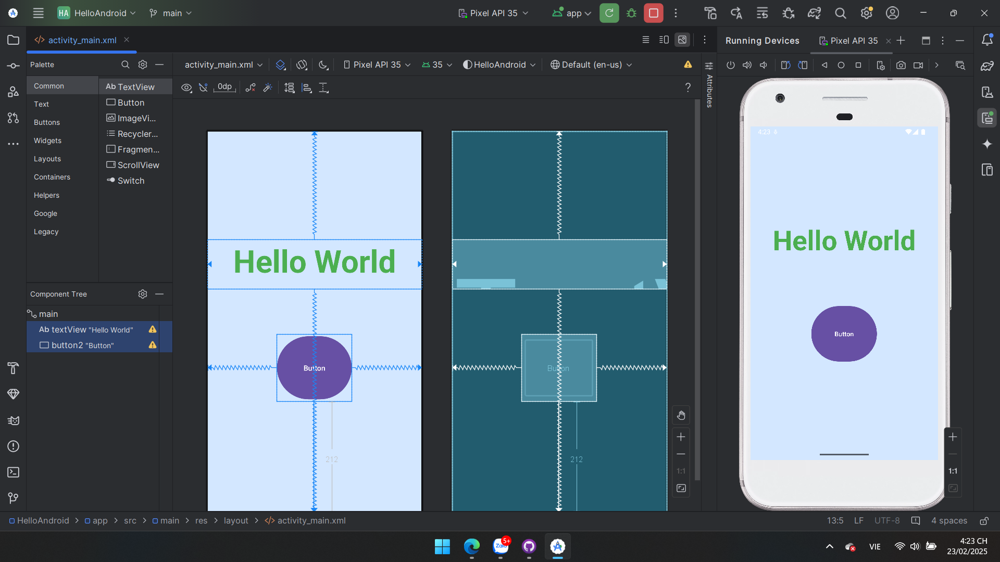

### 🔹 Ex1_ConstraintLayout
- 📂 [Xem mã nguồn](./Ex1_ConstraintLayout/app/src/main/)
- 🖼️ Hình ảnh minh họa:
  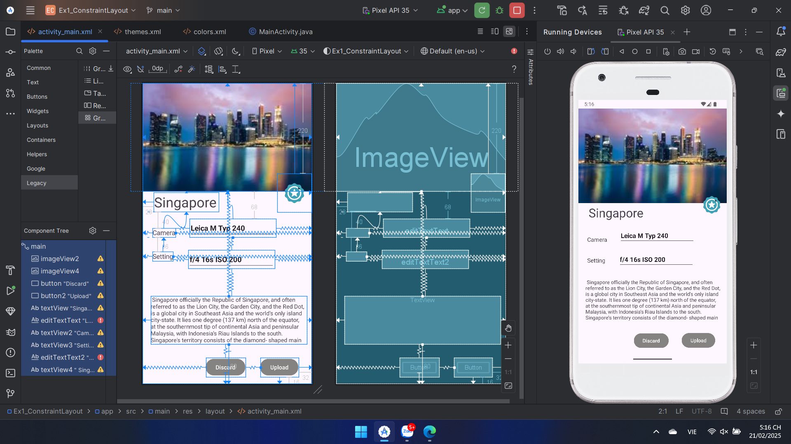

### 🔹 Ex2_LinearLayout
- 📂 [Xem mã nguồn](./Ex2_LinearLayout/app/src/main/)
- 🖼️ Hình ảnh minh họa:
  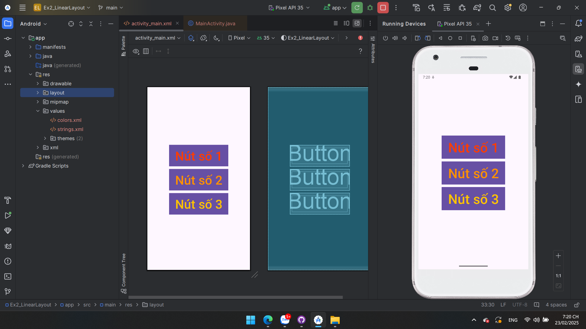

### 🔹 Ex3_SimpleSumApp
- 📂 [Xem mã nguồn](./Ex3_SimpleSumApp/app/src/main/)
- 🖼️ Hình ảnh minh họa:
  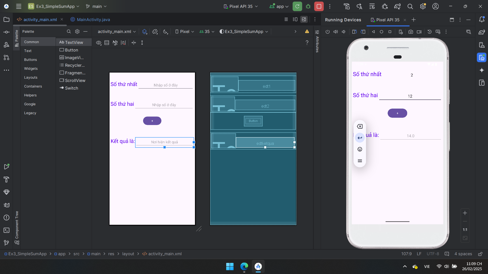

### 🔹 Ex4_AddSubMulDiv_Onclick
- 📂 [Xem mã nguồn](./Ex4_AddSubMulDiv_Onclick/app/src/main/)
- 🖼️ Hình ảnh minh họa:
  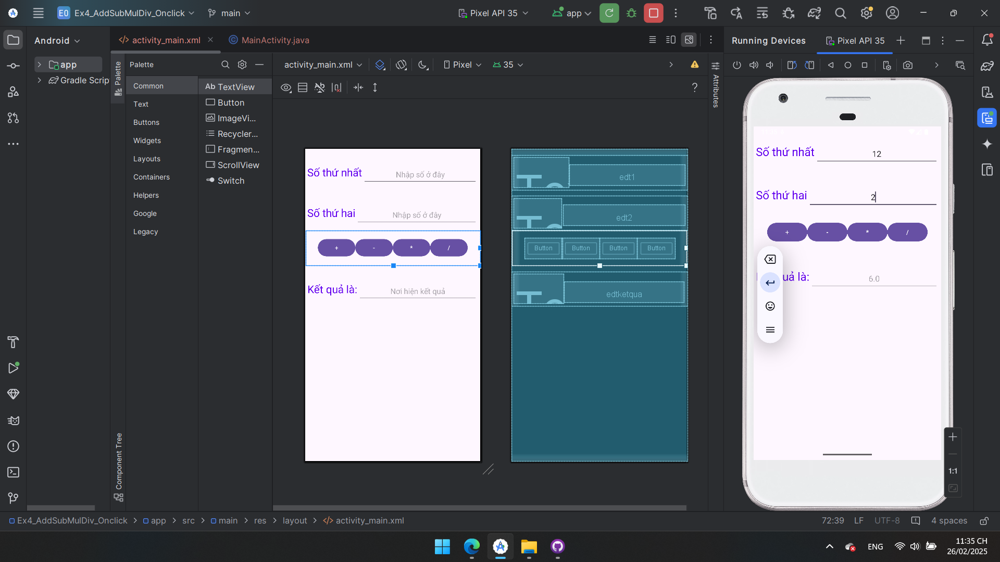

### 🔹 Ex5_AddSubMulDiv_Anynomous
- 📂 [Xem mã nguồn](./Ex5_AddSubMulDiv_Anynomous/app/src/main/)
- 🖼️ Hình ảnh minh họa:
  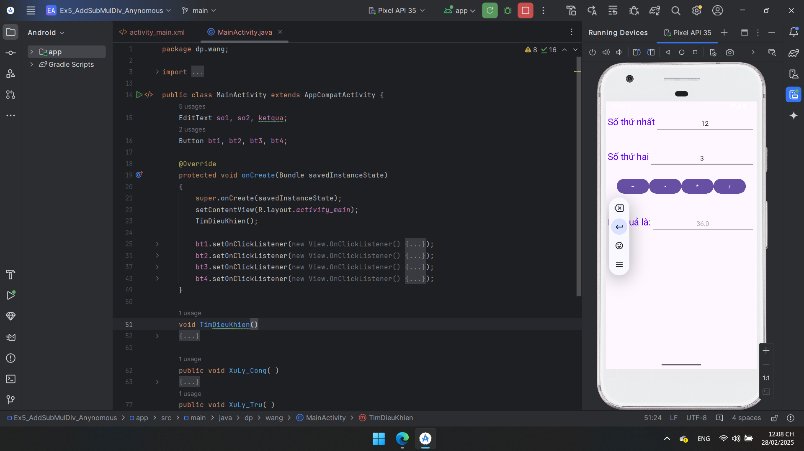

### 🔹 Ex5_AddSubMulDiv_Var
- 📂 [Xem mã nguồn](./Ex5_AddSubMulDiv_Var/app/src/main/)
- 🖼️ Hình ảnh minh họa:
  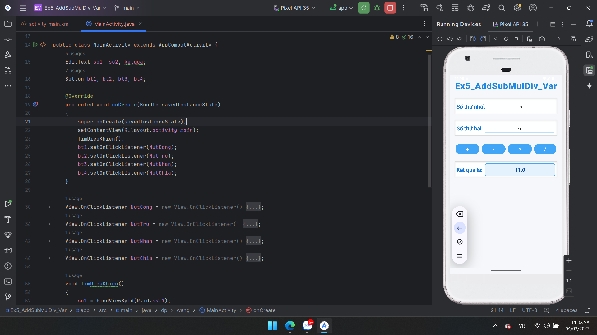

### 🔹 Ex5_AddSubMulDiv_ActivityListenner
- 📂 [Xem mã nguồn](./Ex5_AddSubMulDiv_ActivityListenner/app/src/main/)
- 🖼️ Hình ảnh minh họa:
  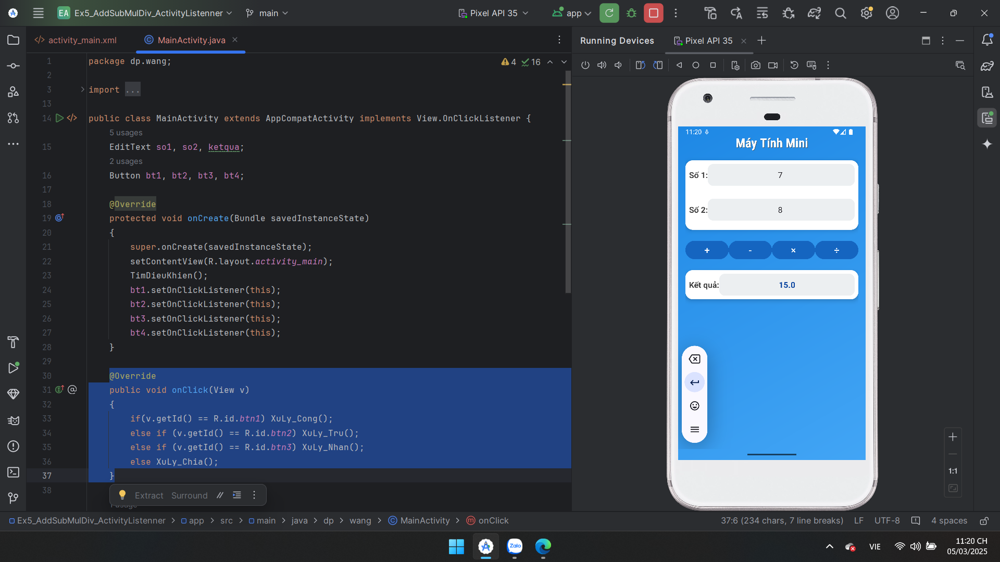

### 🔹 Ex6_IntentDonGian
- 📂 [Xem mã nguồn](./Ex6_IntentDonGian/app/src/main/)
- 🖼️ Hình ảnh minh họa:
  <div style="display: flex; justify-content: center; gap: 10px;">
    
    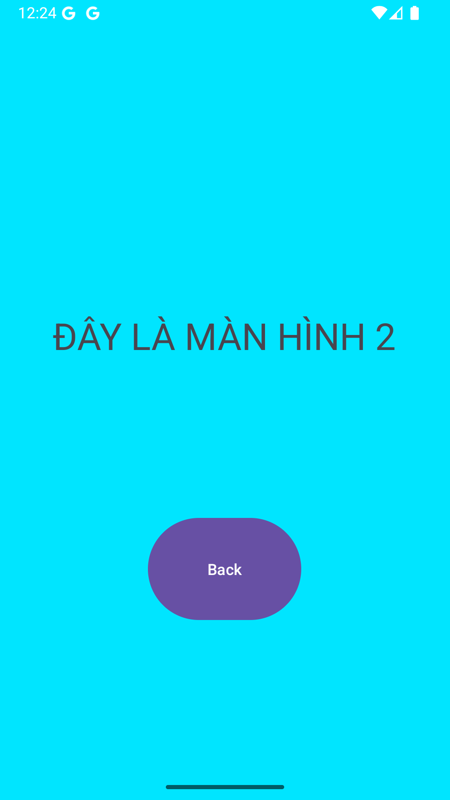
    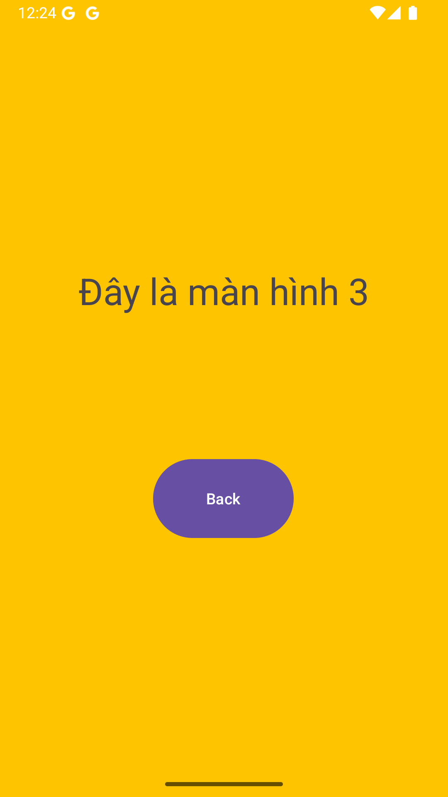
  </div>


### 🔹 Ex7_IntentLogin
- 📂 [Xem mã nguồn](./Ex7_IntentLogin/app/src/main/)
- 🖼️ Hình ảnh minh họa:
 <div style="display: flex; justify-content: center; gap: 10px;">
    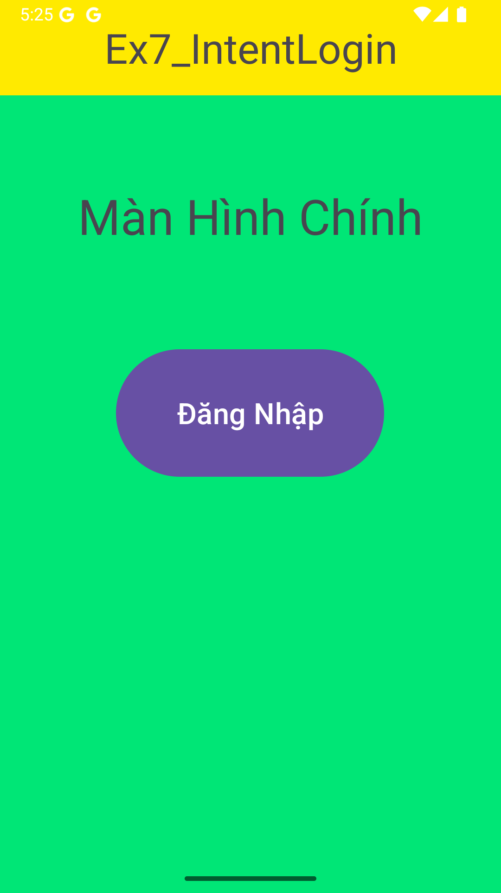
    
    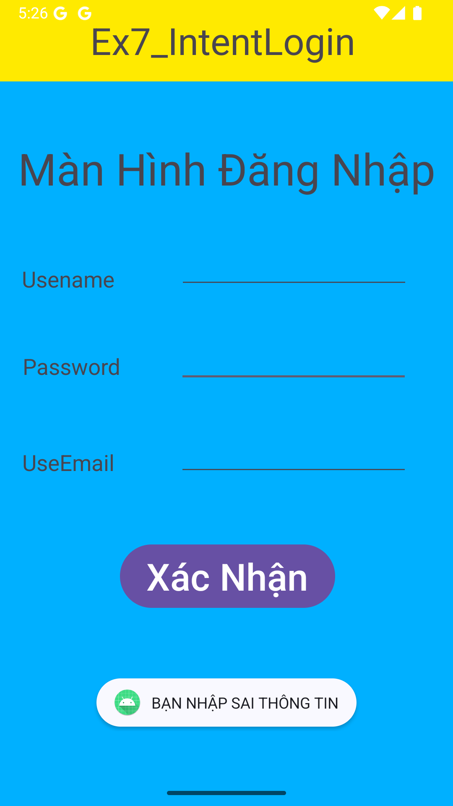
    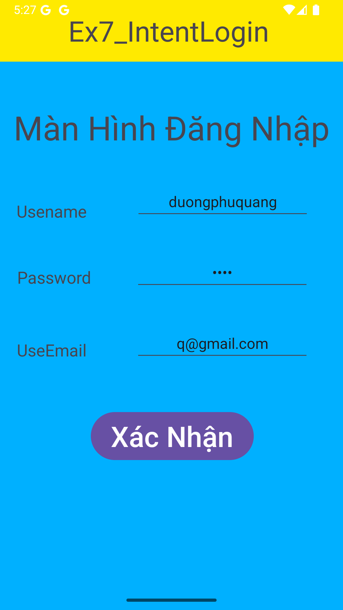
    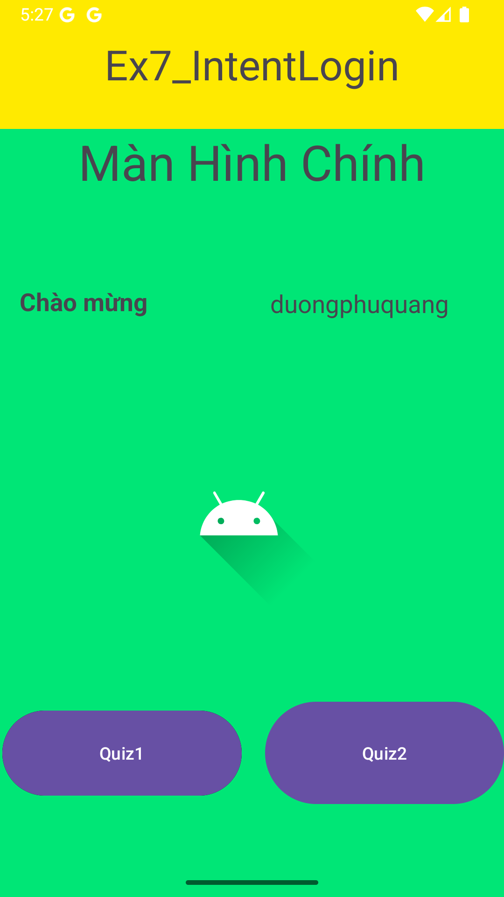
    
  </div>
---
## 📂 😽SOURCES CODE BÀI TẬP VÍ DỤ😽
Dưới đây là các bài tập ví dụ nhằm làm quen với lập trình Android:

### 🔹 ViDu_Intent
- 📂 [Xem mã nguồn](./ViDu_Intent/app/src/main/)
- 🖼️ Hình ảnh minh họa:
 <div style="display: flex; justify-content: center; gap: 10px;">
    
    
  </div>


## 📂 😽SOURCES CODE BÀI TẬP LÀM THÊM😽
Dưới đây là các bài tập mở rộng nhằm nâng cao kỹ năng lập trình Android:

### 🔹 BT_TinhCVvaDT
- 📂 [Xem mã nguồn](./BT_TinhChuVi/app/src/main/)
- 🖼️ Hình ảnh minh họa:
  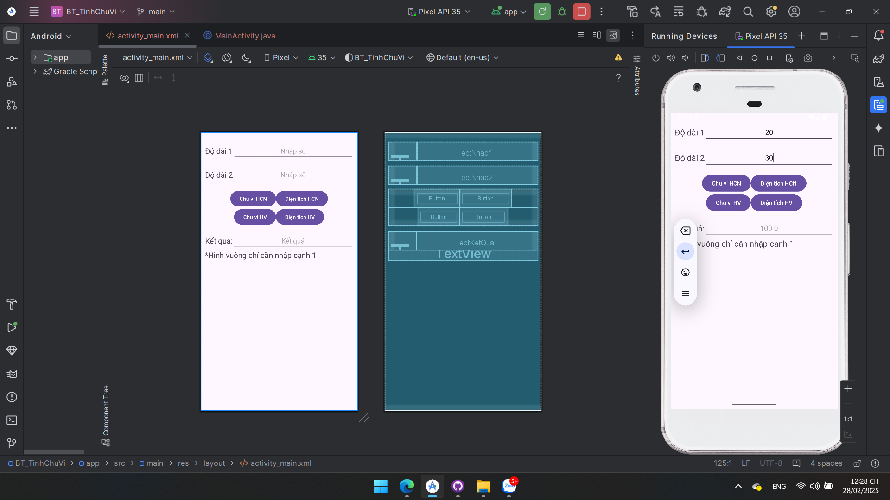

### 🔹 LT_TimesTables
- 📂 [Xem mã nguồn](./LT_TimesTables/app/src/main/)
- 🖼️ Hình ảnh minh họa:
  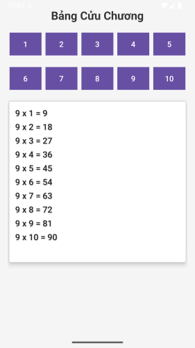

---

## 📌 Hướng dẫn sử dụng
### 🔹 Cách chạy project
1. Clone repository về máy:
   ```sh
   git clone <repository_url>
   ```
2. Mở dự án bằng **Android Studio**.
3. Chạy ứng dụng trên **trình giả lập** hoặc **thiết bị thật**.

### 🔹 Yêu cầu hệ thống
- Android Studio phiên bản mới nhất.
- Java/Kotlin đã được cài đặt.
- Thiết bị chạy Android API **26+** (hoặc trình giả lập tương ứng).

---

## 📌 Góp ý & Liên hệ
Nếu bạn có bất kỳ câu hỏi hoặc góp ý nào, hãy tạo **Issue** trên GitHub hoặc liên hệ trực tiếp.

🚀 *Happy Coding!* 🚀

