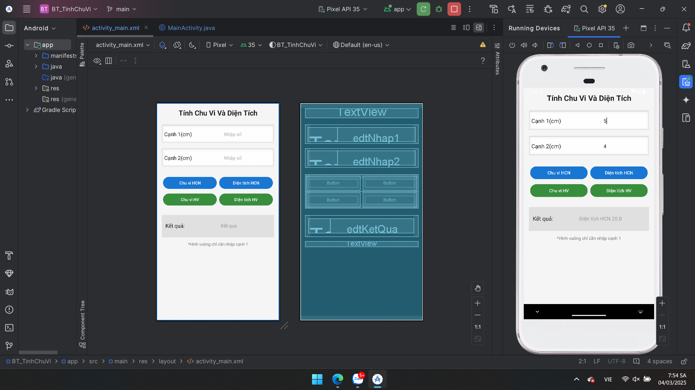

# 64131942-AndroidProgramming
Các bài thực hành và bài tập được lưu tại đây và Push lên server thường xuyên để thầy tracking quá trình

## 😽SOURCES CODE BÀI TẬP THỰC HÀNH😽

[Ex1_Hello](./HelloAndroid/app/src/main/)

[Ex1_ConstraintLayout](./Ex1_ConstraintLayout/app/src/main/)

[Ex2_LinearLayout](./Ex2_LinearLayout/app/src/main/)

[Ex3_SimpleSumApp](./Ex3_SimpleSumApp/app/src/main/)

[Ex4_AddSubMulDiv_Onclick](./Ex4_AddSubMulDiv_Onclick/app/src/main/)

[Ex5_AddSubMulDiv_Anynomous](./Ex5_AddSubMulDiv_Anynomous/app/src/main/)

## 😽SOURCES CODE BÀI TẬP LÀM THÊM😽

[BT_TinhCVvaDT](./BT_TinhChuVi/app/src/main/)

